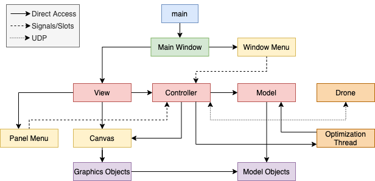

# Graphical User Interface for Trajectory Generation with Convex Optimization
#### Autonomous Controls Lab, University of Washington AA Department

### Table of Contents
1. [Overview](#overview)
1. [Architecture](#architecture)
1. [Style](#style)

### Overview
User can visually model various two dimensional shapes such as ellipses, polygons, and planes and convert them into constraints for convex optimization. Application also models drone position, target waypoints, and current drone path. Layouts can be saved and loaded to and from files. Models can be mapped to ports for real time updating via UDP. Built on Qt framework for deployment on multiple platforms.

### Architecture

This GUI is implemented with a Model-View-Controller design pattern. The view renders the graphical information stored in the canvas, the model stores the constraint data, and the controller manipulates the model and canvas. The primary purpose of this is for the controller to act as a bottleneck for modifying the model. User interaction from buttons and mouse is connected to the controller via Qt signals and slots. The canvas and model can be deleted (with the destructor handling cleanup of associated graphics objects or model objects) to be replaced with new data from config files.

### Style

This project follows [Qt best practices](https://doc.qt.io/qt-5/reference-overview.html) and the [Google C++ Style Guide](https://google.github.io/styleguide/cppguide.html) verified with [cpplint.py](https://google.github.io/styleguide/cppguide.html#cpplint)
